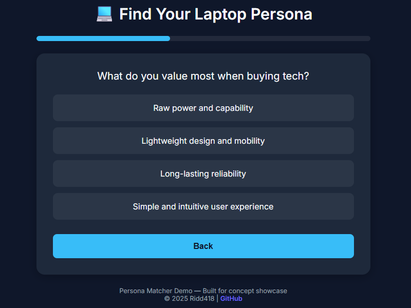

# Persona Matcher 🧘‍♂️

A **smart, extensible preference-based product recommendation engine** built with **Vanilla JavaScript, HTML, and CSS**.  

It profiles users through a **trait-based scoring quiz** and maps their answers to **product personas**, making it ideal for recommending laptops, phones, or any product driven by user preferences.

---

## 🎯 Features

- **JSON-driven quizzes** – Add/remove questions, options, and traits without touching engine logic  
- **Trait scoring system** – Dynamically calculates scores for traits like `PERF`, `PORT`, `BATT`, etc.  
- **Dynamic persona matching** – Picks the persona based on dominant traits  
- **Lightweight, modular JS engine** – No frameworks required  
- **Mobile-friendly UI** – Fully responsive, clean component-based layout  
- **Extensible** – Supports any product category or persona type  

---

## 🖥️ Demo

Check out the live demo:
<a href="https://ridd418.github.io/persona-matcher/" target="_blank" rel="noopener noreferrer">
  Live Demo
</a>

---

## 🧠 How It Works

1. Each quiz answer contributes points to defined traits.  
2. After all questions, the engine calculates trait scores.  
3. The highest-scoring trait determines the **primary persona**.  
4. A tailored recommendation text is displayed.  

> Works like a personality test rather than a rigid survey.

---

## 🧩 Architecture

The **Persona Matcher** is built with **modularity, separation of concerns, and immutability**. It is divided into three main layers: **Data Layer**, **Engine Layer**, and **Presentation Layer**.  

```

User Interaction
│
▼
Presentation Layer (script.js + index.html + styles.css)
│
▼
Engine Layer (quizEngine.js)
│
▼
Data Layer (dataFetcher.js + data/data.json)

````

### Module Responsibilities

| Module | Responsibility |
|--------|----------------|
| **dataFetcher.js** | Fetches JSON quiz data and freezes it (immutable). |
| **/data/data.json** | Contains all quiz definitions: questions, options, traits, results. Fully extensible. |
| **quizEngine.js** | Handles internal quiz state, scoring, next/back navigation, and emits snapshots to the presentation layer. |
| **script.js** | Orchestrates the app: initializes engine, renders UI, listens to user events. Receives state snapshots from the engine. |
| **index.html / styles.css** | Layout and responsive styling; fully decoupled from quiz logic. |

### Flow Overview

1. **Initialization**
   - `script.js` fetches immutable JSON data via `dataFetcher.js`.
   - `startQuiz` initializes the engine, passing rendering callbacks.

2. **Question Rendering**
   - Engine emits the current question snapshot.
   - `script.js` renders the question, options, and progress bar.

3. **Answer Handling**
   - User selects an option → event listener calls `engine.answer(optionId)`.
   - Engine updates internal scores and emits next question snapshot.
   - Presentation layer renders the updated question.

4. **Navigation**
   - User clicks **Back** → event listener calls `engine.goBack()`.
   - Engine reverses last answer, updates scores, emits previous question snapshot.
   - Presentation layer renders previous question.

5. **Result Calculation**
   - After all questions, engine calculates the highest-scoring trait.
   - Finds the corresponding persona in JSON.
   - Calls render callback to display final persona and recommendations.

### Design Principles

- **Separation of Concerns:** Engine, data, and UI are fully decoupled.
- **Immutability:** Original JSON is frozen to prevent accidental mutations.
- **Extensibility:** Add new traits, questions, or personas without changing engine logic.
- **Testability:** Engine logic can be tested independently of UI.
- **Reusability:** Engine can be reused in other UI frameworks or interfaces.

---

## 📂 Installation

1. Clone the repository:

    ```bash
    git clone https://github.com/ridd418/deal-timer.git
    cd deal-timer
    ```

2. Install `Docker` and `Docker Compose` if not already installed

3. Deploy using Docker (from the project folder):

    ```bash
    docker compose up -d
    ```

4. Open `http://localhost:4000/` in your browser.

**Tip:** Change the host `port` in `compose.yaml` if needed:

```yaml
ports:
  - "<your port here>:80"
````

**Clean up:**

```bash
docker compose down
```

---

## 🔧 Customization

### Edit Quiz Data

All quiz content is in JSON files in `/data`. Example structure:

```json
{
  "id": "q1",
  "text": "What frustrates you the most?",
  "options": [
    { "id": "a", "text": "Slow performance", "scores": { "PERF": 2 } }
  ]
}
```

You can add or remove:

* Questions
* Options
* Traits
* Result personas

No other files need to change.

### JSON Schema

**Question Object**

```ts
Question {
  id: string,
  text: string,
  options: Option[]
}
```

**Option Object**

```ts
Option {
  id: string,
  text: string,
  scores: { [traitKey: string]: number }
}
```

**Result Persona Object**

```ts
Result {
  id: string,
  primaryTrait: string,
  text: string,
  recommended: string
}
```

The engine is **trait-agnostic**—add as many traits as you want.

---

## 📸 Screenshot



---

## ⭐ Acknowledgments

Inspired by:

* Personality profiling systems (MBTI, Enneagram)
* Modern product recommendation UX
* Preference-based scoring engines

---

## 📝 License

MIT License. See [LICENSE](LICENSE) for details.